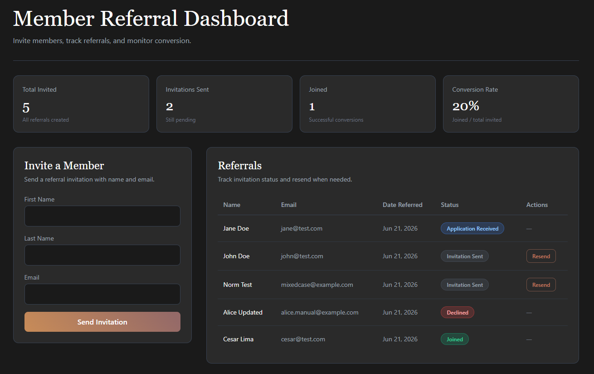

# Member Referral Dashboard

Completed take-home assessment: a referral system where users can invite members, track invitation status, resend invitations, and view analytics.

**Stack:** Django REST Framework + PostgreSQL (backend), Vue 3 + TypeScript + Pinia + Tailwind CSS (frontend).

Original requirements are in [`REQUIREMENTS.md`](REQUIREMENTS.md).



---

## What's implemented

### Backend
- `Referral` model with email normalization (trim + lowercase) and secure invite tokens
- REST API for listing, creating, updating, and deleting referrals
- Resend action with server-side 30-second cooldown and token rotation
- Public token lookup endpoint (safe fields only)
- Analytics endpoint with documented metric definitions
- Django admin for inspecting referrals and advancing status manually
- Integration tests for email uniqueness, resend cooldown, token lifecycle, and analytics

### Frontend
- Invitation form with validation and API error handling
- Referrals list with status badges and resend (with client-side cooldown countdown)
- Analytics cards
- Success toasts for invite and resend actions
- Styling aligned with [10 East](https://10east.co/home) brand tokens (typography, copper palette)

### Code review
- See [`REVIEW_TASK.md`](REVIEW_TASK.md) for the resend endpoint review exercise.

---

## Quick start

### Prerequisites
- Docker and Docker Compose
- Node.js 18+ and npm

### 1. Backend

```bash
docker compose up -d
docker compose exec backend python manage.py migrate
```

Backend runs at **http://localhost:8000**

Verify the API:

```bash
curl http://localhost:8000/api/referrals/
```

Optional — create an admin user for Django admin (`/admin/`):

```bash
docker compose exec backend python manage.py createsuperuser
```

### 2. Frontend

```bash
cd frontend
npm install
cp .env.example .env
npm run dev
```

Frontend runs at **http://localhost:5173**

Ensure `.env` contains:

```
VITE_API_URL=http://localhost:8000/api
```

---

## API

| Method | Endpoint | Description |
|--------|----------|-------------|
| `GET` | `/api/referrals/` | List referrals (paginated) |
| `POST` | `/api/referrals/` | Create referral |
| `GET` | `/api/referrals/{id}/` | Retrieve referral |
| `PATCH` | `/api/referrals/{id}/` | Update referral |
| `DELETE` | `/api/referrals/{id}/` | Delete referral |
| `POST` | `/api/referrals/{id}/resend/` | Resend invitation |
| `GET` | `/api/referrals/lookup/?token=...` | Public token lookup |
| `GET` | `/api/referrals/analytics/` | Referral metrics |

### Analytics definitions

| Metric | Definition |
|--------|------------|
| **Total Invited** | All referrals ever created |
| **Invitations Sent** | Referrals with status `invitation_sent` |
| **Joined** | Referrals with status `joined` |
| **Conversion Rate** | `joined / total_invited × 100` (0% when empty) |

### Token behavior
- Generated with `secrets.token_urlsafe(32)` on create
- Rotated on resend (previous token stops working)
- Invalid once status advances past `invitation_sent`
- No time-based expiry

---

## Testing

```bash
docker compose exec backend python manage.py test referrals
```

Frontend type-check and production build:

```bash
cd frontend
npm run build
```

---

## Project structure

```
├── backend/
│   ├── config/           # Django settings
│   └── referrals/        # Models, API, tests, admin
├── frontend/
│   └── src/
│       ├── api/          # Axios client and API calls
│       ├── components/   # Vue UI components
│       ├── stores/       # Pinia state
│       └── types/        # TypeScript interfaces
├── docker-compose.yml
├── assets/               # Dashboard screenshot
├── REQUIREMENTS.md       # Original assessment spec
└── REVIEW_TASK.md        # Code review exercise
```

---

## Development notes

### Backend

```bash
# Migrations
docker compose exec backend python manage.py makemigrations
docker compose exec backend python manage.py migrate

# Logs
docker compose logs -f backend
```

Referral status can be advanced via Django admin to test token invalidation and analytics (no status-change UI in the dashboard by design).

### Frontend

The Vite dev server hot-reloads on save.

---

## Troubleshooting

**Backend won't start**
```bash
docker compose logs backend
docker compose down && docker compose up --build
```

**Database connection errors**
```bash
docker compose ps
docker compose down -v && docker compose up -d   # resets data
```

**Frontend can't reach API**
- Confirm backend is up: `curl http://localhost:8000/api/referrals/`
- Check `frontend/.env` has `VITE_API_URL=http://localhost:8000/api`
